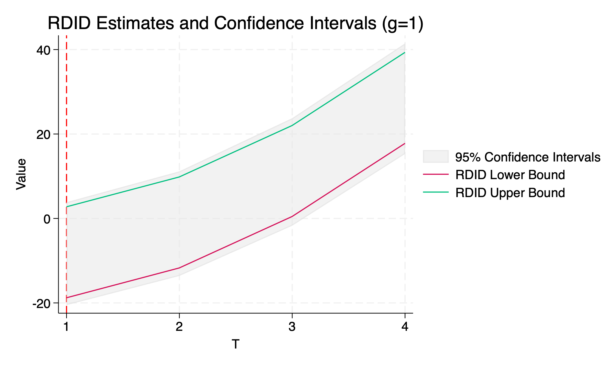
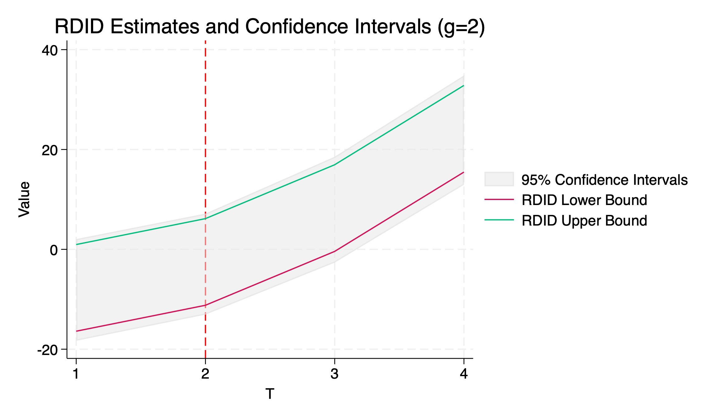
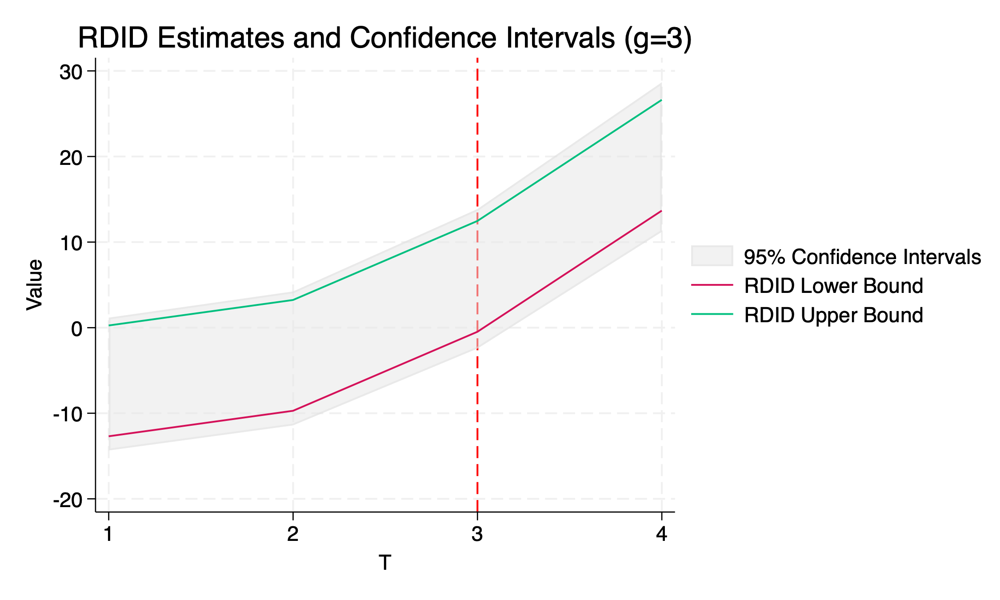
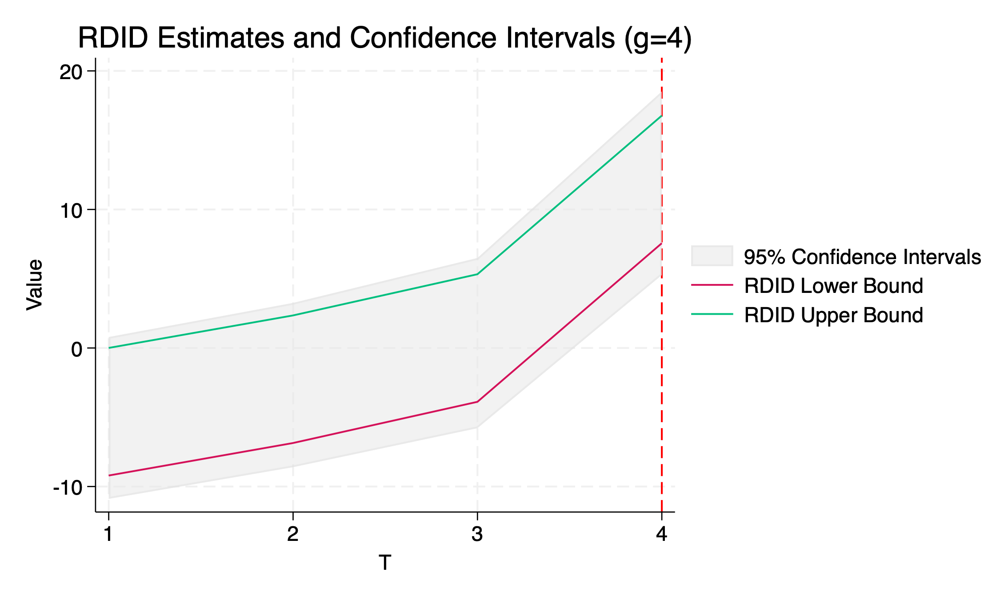

_version 1.8.1_

rdidstag
====

a program that implements the robust difference-in-differences (RDID) method in staggered adoption design developed in Ban and Kédagni (2023) in Stata

Syntax
------

> __rdidstag__ _depvar_ [_indepvars_] [_if_] [_in_], __gname(_varname_)__ __tname(_varname_)__ [_options_]

### Options

| _options_                     | Description
|:------------------------------|:-------------------------------------------------
| Main                          |   
|        __gname(_varname_)__       | specifies the variable name of the cohort index where __0__ is 
|                                       |‎   assigned for the never-treated group
|        __tname(_varname_)__       | specifies the variable name of time index  
|                                   |
| Options                       |  
|        __postname(_varname_)__    | specifies the variable name of the post-treatment period 
|                                       |‎   indicator; the default is using units in periods during 
|                                       |‎   and after the first treatment as post-period units
|        __infoname(_varname_)__    | specifies the variable name of the information index; 
|                                       |‎   the default is using pre-treatment periods
|        __level(_#_)__             | specifies the confidence level, as a percentage, 
|                                       |‎   for confidence intervals; the default is __level(95)__ 
|        __figure(_string_)__       | saves line plots of RDID bounds and confidence intervals 
|                                       |‎   over the post-treatment periods for each group as  
|                                       |‎   __figure(_string_).png__ 
|        __clustername(_varname_)__ | specifies the variable name that identifies resampling 
|                                       |‎   clusters in bootstrapping  

Description
-----------

__rdidstag__ command estimates bounds on the ATT and their confidence intervals over time for different cohorts in the staggered adoption design. Please visit our [GitHub repository](https://github.com/KyunghoonBan/rdid) for more details.

Example
-------

Estimate the RDID bounds on the ATT over time for different cohorts:

         . use "sim_rdidstag.dta"
         . rdidstag Y, g(G) t(year) post(posttreat) info(year) figure(sim_rdidstag)
             

             
Authors
-------

Kyunghoon Ban  
_kban@saunders.rit.edu_  
[https://sites.google.com/view/khban/](https://sites.google.com/view/khban/)  

Désiré Kédagni         
_dkedagni@unc.edu_   
[https://sites.google.com/site/desirekedagni/](https://sites.google.com/site/desirekedagni/)

References
----------

Ban, K. and D. Kédagni (2023). Robust Difference-in-Differences Models. [https://arxiv.org/abs/2211.06710](https://arxiv.org/abs/2211.06710/)      
Ban, K. and D. Kédagni (2024). rdid and rdidstag: Stata commands for robust difference-in-differences.  [https://arxiv.org/XXXX](https://arxiv.org/XXXX)  

License
-------

MIT License

